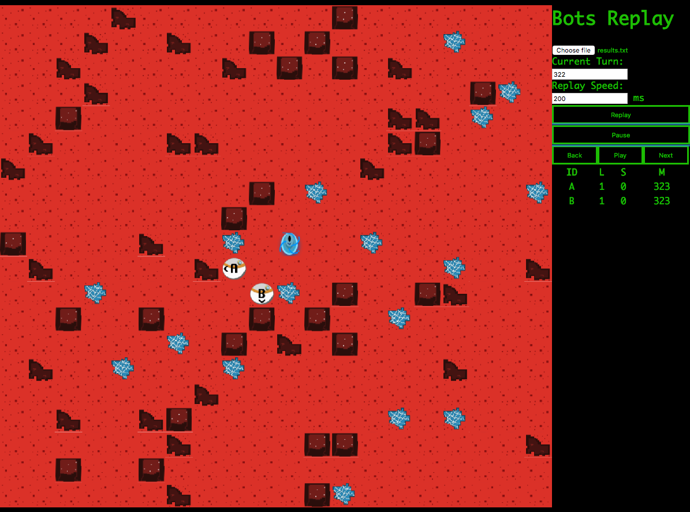

Bots Replay
===========

This is a tool to visualize a game played with the bots server.

The server can be found [here](https://github.com/markusfisch/bots).



## Run

The code is primary written for chrome but should at least work for Firefox aswell.
For running the project with chrome you have to start a simple web server. The following script shows how to do this with `python`.

```
 python -m SimpleHTTPServer 8000

```

## Usage

There are two different ways to load a replay of a bots game with this visualization. For both of them you have to ensure that the actual game has fully come to an end and was formatted in json.

### Upload file

First you have to start the bots server:
```
./bots escape -G1 -F json >> results.json 
```
If the game is done you can upload the results.json to the visualization using the upload button on the webpage.

### Include file on start

If you want to automatically load the latest game into the visualization you can import it as a javascript file. 

Therefore you have to start the server in the following manner:

```
echo "var lastGame= (./bots escape -G1 -F json)" > ../botsReplay/results.js
```

This will create a results.js file within the directory of the visualization which can be loaded when the site is refreshed. 

If it appears that the visualization is always loading an old gameplay please check if your cache is disabled or if the json is invalid.
